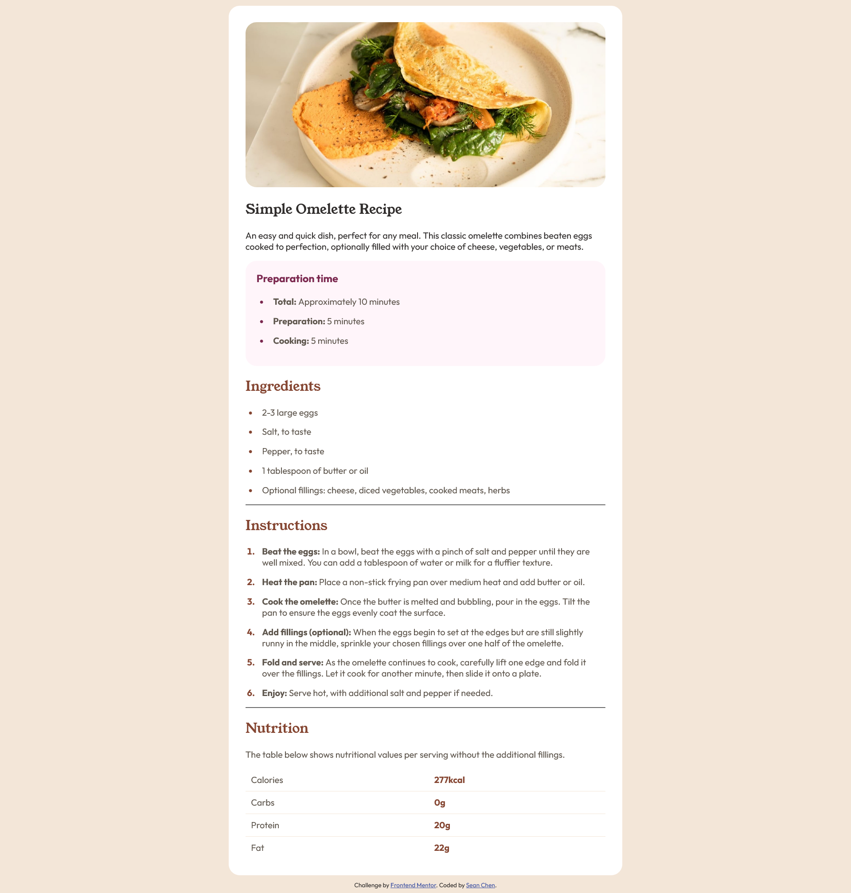

# Frontend Mentor - Recipe page solution

## Table of contents

- [Overview](#overview)
  - [The challenge](#the-challenge)
  - [Screenshot](#screenshot)
  - [Links](#links)
- [My process](#my-process)
  - [Built with](#built-with)
  - [What I learned](#what-i-learned)
  - [Continued development](#continued-development)
- [Author](#author)

## Overview

### Screenshot

### Links

- Solution URL: [Add solution URL here](https://your-solution-url.com)
- Live Site URL: [Add live site URL here](https://your-live-site-url.com)

## My process

### Built with

- HTML
- CSS

### What I learned

For this project, I further refined my CSS skills and learned how to reduce duplications in CSS files. Learning how to set the markers to a different color seemed tricky at first but with some guidance from w3schools, I was able to do it. 

### Continued development

What I plan to do is to further refine the CSS used just so its maintainable and reusable.

## Author

- Frontend Mentor - [@chenmeister](https://www.frontendmentor.io/profile/chenmeister)

